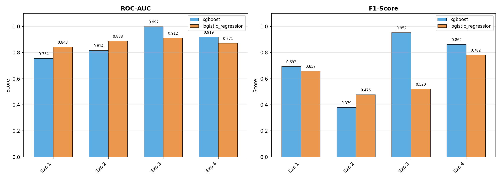
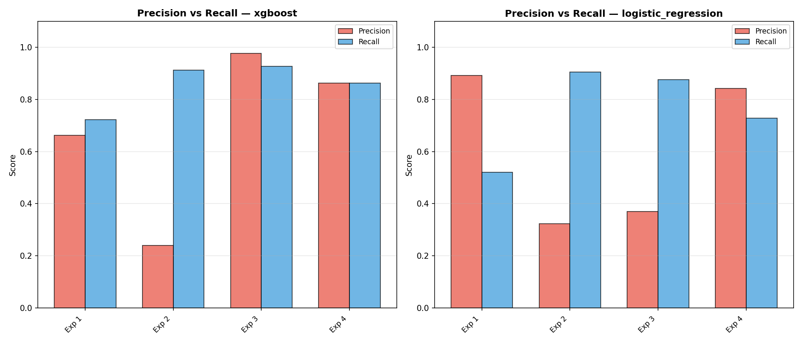
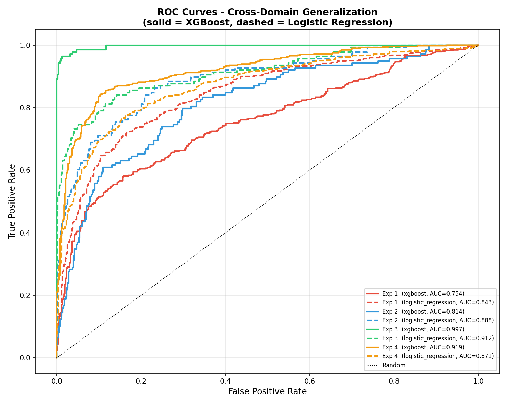
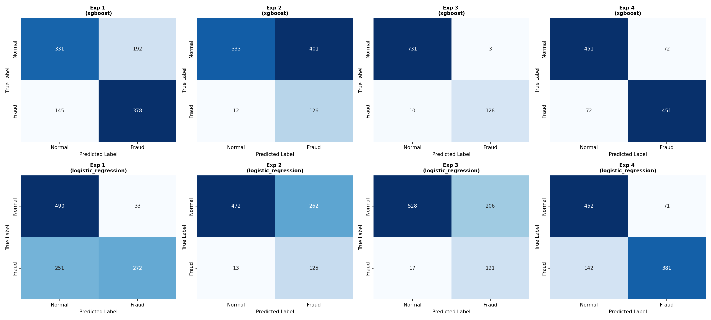

# Credit Card Fraud Detection: Cross-Domain Generalization

A machine learning project testing whether a fraud detection model trained on one credit card dataset generalizes to a completely different one, comparing XGBoost against Logistic Regression across 4 experiments.

## Highlights

- Compared XGBoost vs. Logistic Regression across two independent credit card fraud datasets
- Designed per-domain feature scaling to keep cross-dataset comparisons valid
- Best model achieved **0.997 ROC-AUC / 0.95 F1** when trained on combined data and tested in-domain
- Simpler Logistic Regression baseline **outperformed XGBoost** on pure cross-dataset transfer (0.84–0.89 ROC-AUC vs. 0.75–0.81)

## Features

- Shared feature engineering pipeline (log-transformed amount, temporal features) applied to two structurally different datasets
- Per-domain feature scaling to prevent the model from learning dataset identity instead of fraud patterns
- Class imbalance handled via SMOTE oversampling + random undersampling
- 4 cross-domain train/test configurations, each run with both XGBoost and Logistic Regression
- Automated evaluation: ROC-AUC, F1, precision, recall, confusion matrices, ROC curves

## Results

| Experiment | Algorithm | ROC-AUC | F1 | Precision | Recall |
|---|---|---|---|---|---|
| Train A → Test B | XGBoost | 0.7540 | 0.6917 | 0.6632 | 0.7228 |
| Train A → Test B | Logistic Regression | 0.8429 | 0.6570 | 0.8918 | 0.5201 |
| Train B → Test A | XGBoost | 0.8141 | 0.3789 | 0.2391 | 0.9130 |
| Train B → Test A | Logistic Regression | 0.8877 | 0.4762 | 0.3230 | 0.9058 |
| Train Fused → Test A | XGBoost | 0.9971 | 0.9517 | 0.9771 | 0.9275 |
| Train Fused → Test A | Logistic Regression | 0.9117 | 0.5204 | 0.3700 | 0.8768 |
| Train Fused → Test B | XGBoost | 0.9191 | 0.8623 | 0.8623 | 0.8623 |
| Train Fused → Test B | Logistic Regression | 0.8707 | 0.7815 | 0.8429 | 0.7285 |






## Key Findings

- **Cross-domain generalization is limited without fusion** — training on one dataset and testing on the other tops out around 0.77–0.89 ROC-AUC.
- **Logistic Regression generalizes better across domains alone** — its linear boundary transfers more conservatively than XGBoost's more complex trees, which pick up dataset-specific quirks.
- **XGBoost wins once trained on combined data**— with more data and cross-dataset patterns available, its non-linear modeling becomes an advantage.
- **Precision/recall tradeoffs differ by algorithm** — Logistic Regression flags fewer transactions but is more confident about the ones it does flag.

## Tech Stack

Python 3 · pandas · scikit-learn · XGBoost · imbalanced-learn · matplotlib · seaborn

## Datasets

- [Fraud Detection](https://www.kaggle.com/datasets/bannourchaker/frauddetection) 
- [Credit Card Fraud Data](https://www.kaggle.com/datasets/neharoychoudhury/credit-card-fraud-data) 

Not included in this repo due to size — download from the links above.

## Installation
```bash
git clone https://github.com/FA-00/credit_card_fraud_detection.git
cd credit_card_fraud_detection
pip install -r requirements.txt
```

## Usage
```bash
python fraud_detection.py
```

Or open fraud_detection_colab.ipynb in [Google Colab](https://colab.research.google.com) and run all cells, uploading the two CSV files when prompted.

Outputs generated:
- roc_auc_f1_comparison.png, precision_recall_comparison.png, roc_curves.png, confusion_matrices.png
- results_summary.csv
- model_fused_test_kaggle.pkl, domain_scalers.pkl

## Notes

- Single train/test split per experiment (no cross-validation)
- Classification threshold fixed at 0.5, not tuned per experiment
- No hyperparameter tuning performed for either model